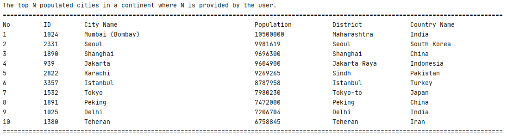

                              | Code Review 1 | Code Review 2 | Code Review 3 | Code Review 4 | Final Deliverable |
|------------------------------|---------------|:-------------:|---------------|---------------|-------------------|
| Hein Thu Aung (40478652)     | 0.25          | 0.25          | 0.25          | 0.25          | 0.25              |
| Aye Myat Eaindray (40478655) | 0.25          | 0.25          | 0.25          | 0.25          | 0.25              |
| Htoo Eain Shin (40478649)    | 0.25          | 0.25          | 0.25          | 0.25          | 0.25              |
| Khine Zin Thwe (40478644)    | 0.25          | 0.25          | 0.25          | 0.25          | 0.25              |

| ID | Name | Met | Screenshot |
| ------- | ----------- | ------- | ----------- |
| 1 | All the countries in the world organised by largest population to smallest. | Yes | 
| 2 | All the countries in a continent organised by largest population to smallest. | Yes | 
| 3 | All the countries in a region organised by largest population to smallest. | Yes | 
| 4 | The top N populated countries in the world where N is provided by the user. | Yes | 
| 5 | The top N populated countries in a continent where N is provided by the user. | Yes | 
| 6 | The top N populated countries in a region where N is provided by the user. | Yes | 
| 7 | All the cities in the world organised by largest population to smallest. | Yes | 
| 8 | All the cities in a continent organised by largest population to smallest. | Yes | 
| 9 | All the cities in a region organised by largest population to smallest. | Yes | 
| 10 | All the cities in a country organised by largest population to smallest. | Yes | 
| 11 | All the cities in a district organised by largest population to smallest. | Yes | 
| 12 | The top N populated cities in the world where N is provided by the user. | Yes | 
| 13 | The top N populated cities in a continent where N is provided by the user. | Yes | 
| 14 | The top N populated cities in a region where N is provided by the user. | Yes | 
| 15 | The top N populated cities in a country where N is provided by the user. | Yes | 
| 16 | The top N populated cities in a district where N is provided by the user. | Yes | 
| 17 | All the capital cities in the world organised by largest population to smallest. | Yes | 
| 18 | All the capital cities in a continent organised by largest population to smallest. | Yes | 
| 19 | All the capital cities in a region organised by largest to smallest. | Yes | 
| 20 | The top N populated capital cities in the world where N is provided by the user. | Yes | 
| 21 | The top N populated capital cities in a continent where N is provided by the user. | Yes | 
| 22 | The top N populated capital cities in a region where N is provided by the user. | Yes | 
| 23 | The population of people, people living in cities, and people not living in cities in each continent. | Yes | 
| 24 | The population of people, people living in cities, and people not living in cities in each region. | Yes | 
| 25 | The population of people, people living in cities, and people not living in cities in each country. | Yes | 
| 26 | The population of the world. | Yes | 
| 27 | The population of a continent. | Yes | 
| 28 | The population of a region. | Yes | 
| 29 | The population of a country. | Yes | 
| 30 | The population of a district. | Yes | 
| 31 | The population of a city. | Yes | 
| 32 | Languages from greatest number to smallest -> Chinese. | Yes | 
| 33 | Languages from greatest number to smallest -> English. | Yes | 
| 34 | Languages from greatest number to smallest -> Hindi. | Yes | 
| 35 | Languages from greatest number to smallest -> Spanish. | Yes | 
| 36 | Languages from greatest number to smallest -> Arabic. | Yes | 